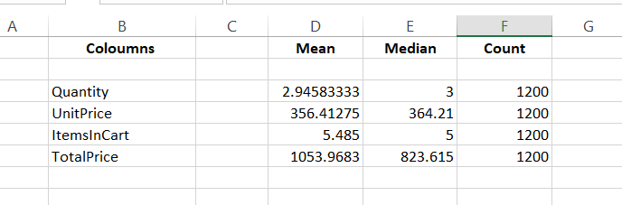
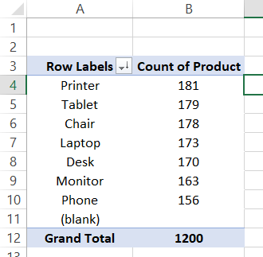
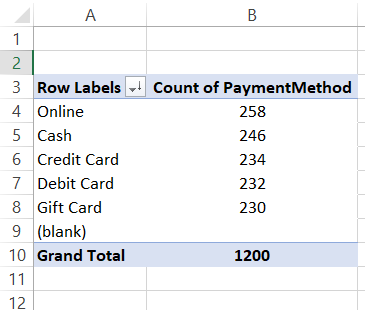
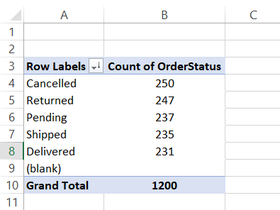
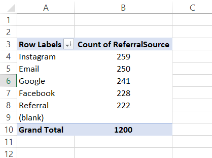

# 📈 Project 2: Exploratory Data Analysis (EDA)

> **Data Analytics Internship Project – DecodeLabs**

## 📌 Overview

This project focuses on **Exploratory Data Analysis (EDA)** using Microsoft Excel on an e-commerce dataset. The objective was to explore the dataset, understand its characteristics, calculate descriptive statistics, identify trends, detect potential outliers, and derive meaningful business insights before further analysis or visualization.

---

## 🎯 Objectives

- Understand the dataset structure
- Perform descriptive statistical analysis
- Identify trends and patterns
- Detect potential outliers
- Generate meaningful business insights

---

## 🛠️ Tools & Techniques

- Microsoft Excel
- Pivot Tables
- Excel Functions (AVERAGE, MEDIAN, COUNT)
- Sorting & Filtering

---

## 📂 Dataset Information

| Attribute | Value |
|-----------|------:|
| Total Rows | 1,200 |
| Total Columns | 14 |

### Features

- OrderID
- Date
- CustomerID
- Product
- Quantity
- UnitPrice
- ShippingAddress
- PaymentMethod
- OrderStatus
- TrackingNumber
- ItemsInCart
- CouponCode
- ReferralSource
- TotalPrice

---

# 🔍 Exploratory Data Analysis Process

## 1️⃣ Dataset Inspection

- Reviewed the dataset structure
- Identified numerical and categorical variables
- Verified data types before analysis

---

## 2️⃣ Descriptive Statistics

Calculated the following statistical measures for:

- Quantity
- UnitPrice
- ItemsInCart
- TotalPrice

Statistics calculated:

- Mean
- Median
- Count

---

## 3️⃣ Trend Analysis

Used **Pivot Tables** to identify:

- Most frequently ordered product
- Most preferred payment method
- Most common order status
- Most effective referral source

---

## 4️⃣ Outlier Detection

Reviewed numerical columns by sorting values from highest to lowest and lowest to highest to identify unusually large or small values.

No significant outliers were observed during the analysis.

---

# 📊 Key Observations

- The most frequently ordered product was **Printer**.
- **Online** was the most preferred payment method among customers.
- Most orders were successfully **Cancelled**.
- **Instagram** generated the highest number of customer referrals.
- No significant outliers were found in the numerical columns.

---

# 📈 Skills Demonstrated

- Exploratory Data Analysis (EDA)
- Descriptive Statistics
- Pivot Table Analysis
- Trend Analysis
- Data Interpretation
- Microsoft Excel

---

# 🚀 Project Outcome

Successfully explored and analyzed the dataset by calculating descriptive statistics, identifying trends, reviewing outliers, and summarizing key findings. The analysis provided valuable insights into customer purchasing behavior and prepared the dataset for future visualization and reporting.

---

## 📷 Project Screenshots

### Descriptive Statistics

---

### Product Trend Analysis

---

### Payment Method Analysis

---

### Order Status Analysis

---

### Referral Source Analysis

---

## 👩‍💻 Author

**Navya Agarwal**

Data Analytics Intern | DecodeLabs
