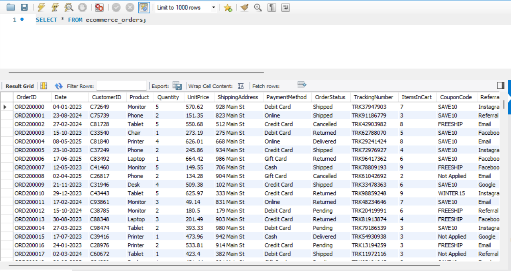
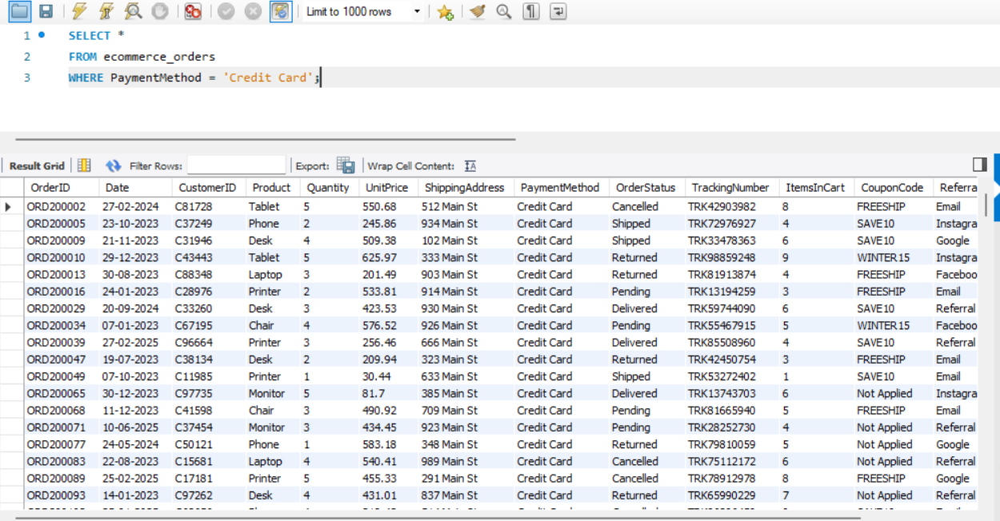
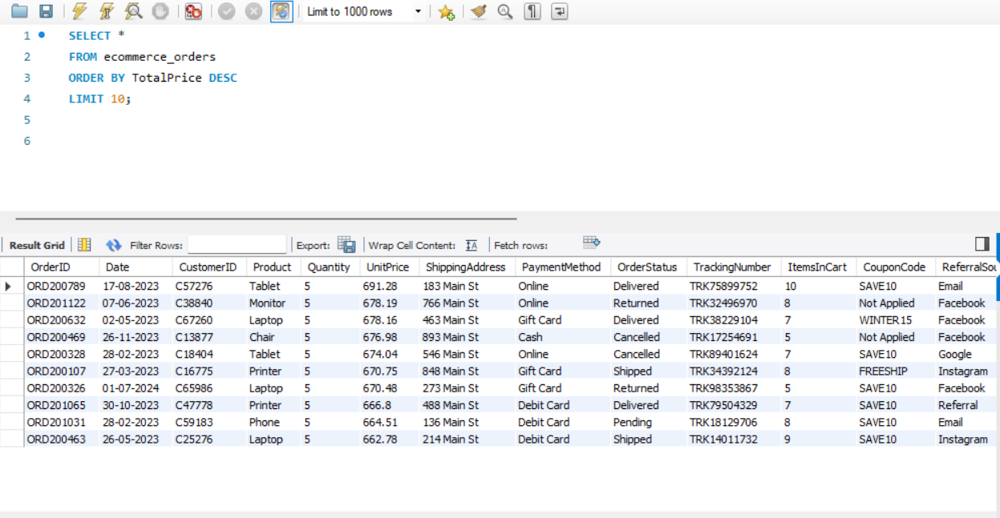
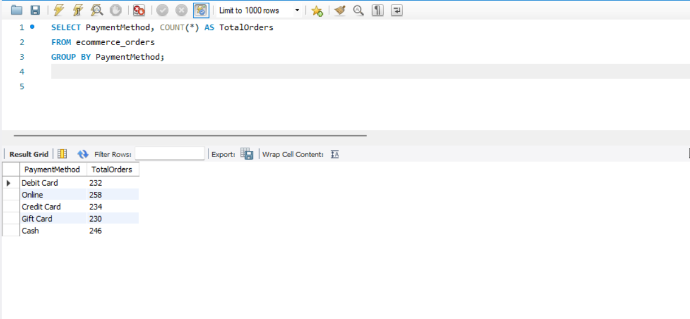
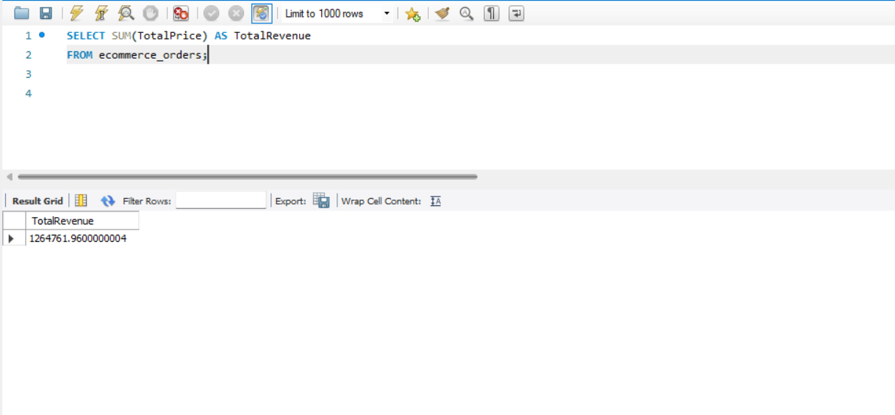
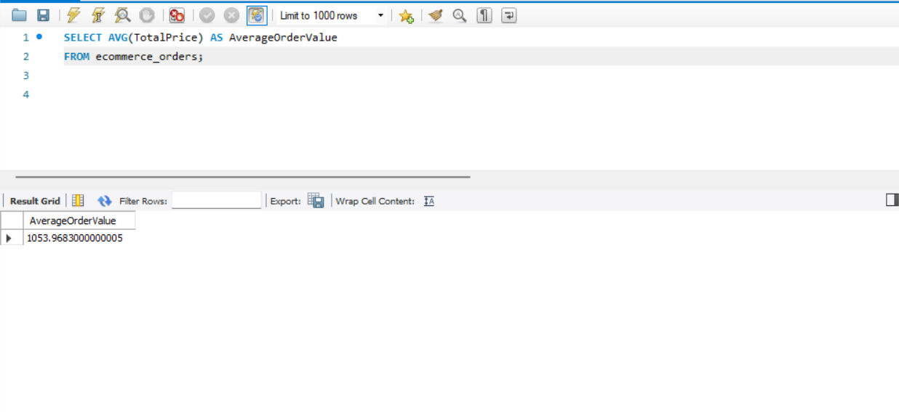

# 🗄️ Project 3: SQL for Data Analysis

> **Data Analytics Internship Project – DecodeLabs**

## 📌 Overview

This project focuses on performing **data analysis using SQL** on a cleaned e-commerce dataset. The objective was to retrieve, filter, sort, group, and summarize data using SQL queries to generate meaningful business insights.

The project was completed using **MySQL Workbench**, demonstrating fundamental SQL concepts commonly used in data analytics.

---

## 🎯 Objectives

- Retrieve data using SQL queries
- Filter records based on specific conditions
- Sort data in ascending or descending order
- Group data to generate summaries
- Perform aggregate calculations
- Extract meaningful business insights

---

## 🛠️ Tools Used

- MySQL Workbench
- SQL

---

## 📂 Dataset Information

| Attribute | Value |
|-----------|------:|
| Total Rows | 1,200 |
| Total Columns | 14 |

### Dataset Features

- OrderID
- Date
- CustomerID
- Product
- Quantity
- UnitPrice
- ShippingAddress
- PaymentMethod
- OrderStatus
- TrackingNumber
- ItemsInCart
- CouponCode
- ReferralSource
- TotalPrice

---

# 🔍 SQL Operations Performed

## 1️⃣ Retrieve Data

Displayed all records from the dataset using the `SELECT` statement.

```sql
SELECT * FROM ecommerce_orders;
```

---

## 2️⃣ Filter Data

Retrieved orders where the payment method was **Credit Card** using the `WHERE` clause.

```sql
SELECT *
FROM ecommerce_orders
WHERE PaymentMethod = 'Credit Card';
```

---

## 3️⃣ Sort Data

Displayed the top 10 highest-value orders using `ORDER BY`.

```sql
SELECT *
FROM ecommerce_orders
ORDER BY TotalPrice DESC
LIMIT 10;
```

---

## 4️⃣ Group Data

Counted the total number of orders for each payment method using `GROUP BY`.

```sql
SELECT PaymentMethod, COUNT(*) AS TotalOrders
FROM ecommerce_orders
GROUP BY PaymentMethod;
```

---

## 5️⃣ Calculate Total Revenue

Calculated the overall revenue generated using `SUM()`.

```sql
SELECT SUM(TotalPrice) AS TotalRevenue
FROM ecommerce_orders;
```

---

## 6️⃣ Calculate Average Order Value

Calculated the average amount spent per order using `AVG()`.

```sql
SELECT AVG(TotalPrice) AS AverageOrderValue
FROM ecommerce_orders;
```

---

## 📌 Key Observations

- The dataset contains **1,200 customer orders**.
- The total revenue generated was **₹1264761.9600000004**.
- The average order value was **₹1053.9683000000005**.
- **Credit Card** accounted for **234** orders.

---

# 📷 Query Results

### Display All Records



---

### Filter Data Using WHERE



---

### Sort Data Using ORDER BY



---

### Group Data Using GROUP BY



---

### Total Revenue Using SUM()



---

### Average Order Value Using AVG()



---

## 📄 Project Files

- **cleaned_data.csv** – Cleaned e-commerce dataset used for SQL analysis.
- **SQL_Queries.sql** – Contains all SQL queries used in this project.
- **README.md** – Documentation of the project, methodology, and observations.

---

# 📈 Skills Demonstrated

- SQL Fundamentals
- Data Retrieval
- Data Filtering
- Data Sorting
- Data Grouping
- Aggregate Functions
- Business Data Analysis
- MySQL Workbench

---

# 🚀 Project Outcome

Successfully performed SQL-based data analysis by retrieving, filtering, sorting, grouping, and summarizing data from an e-commerce dataset. The project demonstrated the practical use of SQL for extracting business insights and strengthened foundational database querying skills.

---

## 👩‍💻 Author

**Navya Agarwal**

Data Analytics Intern | DecodeLabs


